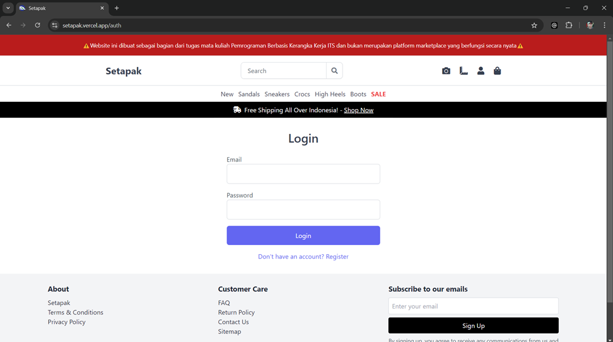
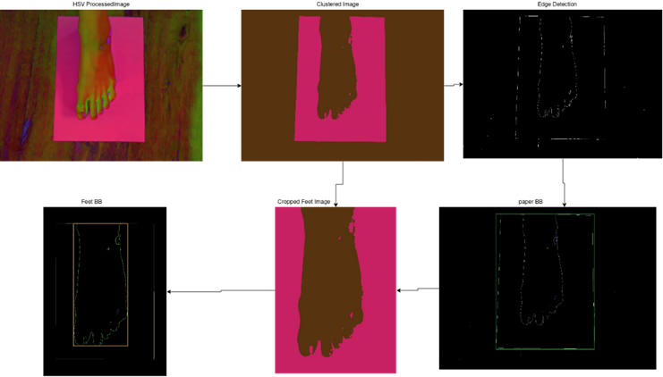
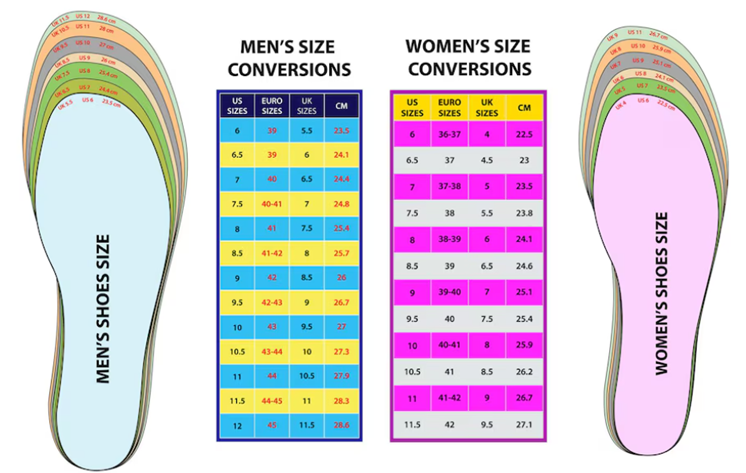
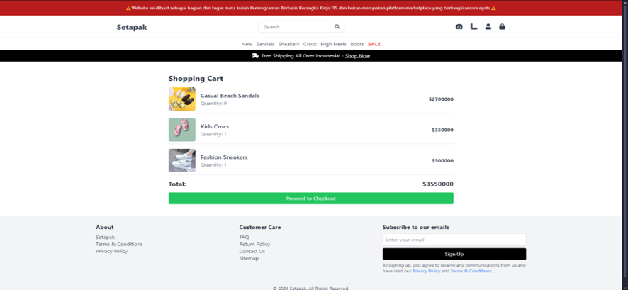

# Buku Petunjuk Setapak: Marketplace Alas Kaki dengan Teknologi AI untuk Pengenalan Gambar dan Pengukuran yang Akurat(User Manual Book)

<h2>Pencipta :</h2>
1. Nathaniel Ryo Kurniadi  
2. Yanuar Eka Pramudya  
3. Daffa Zimraan Hassan
   

# Daftar Isi
- [Buku Petunjuk Setapak: Marketplace Alas Kaki dengan Teknologi AI untuk Pengenalan Gambar dan Pengukuran yang Akurat(User Manual Book)](#buku-petunjuk-setapak-marketplace-alas-kaki-dengan-teknologi-ai-untuk-pengenalan-gambar-dan-pengukuran-yang-akuratuser-manual-book)
- [Daftar Isi](#daftar-isi)
- [Pendahuluan](#pendahuluan)
  - [Tujuan Pembuatan Dokumen](#tujuan-pembuatan-dokumen)
  - [Deskripsi Aplikasi](#deskripsi-aplikasi)
  - [Deskripsi Dokumen](#deskripsi-dokumen)
- [User Manual](#user-manual)
  - [Bagian Aplikasi Setapak](#bagian-aplikasi-setapak)
    - [Halaman Login dan Register](#halaman-login-dan-register)
    - [Halaman Utama](#halaman-utama)
    - [Fitur Deteksi Objek](#fitur-deteksi-objek)
    - [Fitur Pengukuran](#fitur-pengukuran)
    - [Fitur Keranjang Belanja (Cart)](#fitur-keranjang-belanja-cart)
- [Penutup](#penutup)

# Pendahuluan
## Tujuan Pembuatan Dokumen
Pembuatan dokumen user manual ini adalah untuk memberikan gambaran kepada pengguna mengenai aplikasi web marketplace Setapak.  Penjelasan ini meliputi cara penggunaan website Setapak beserta fitur-fiturnya yang dapat membantu pengguna dalam berbelanja.
## Deskripsi Aplikasi
Setapak merupakan marketplace khusus alas kaki yang berbasis website dengan terobosan dalam teknologi deteksi objek untuk pengguna. Teknologi ini dibangun dengan menggunakan platform Roboflow yang diintegrasikan langsung ke aplikasi Setapak. Dengan fitur deteksi objek, pengguna dapat mengunggah sebuah gambar alas kaki dan Setapak akan memberikan rekomendasi-rekomendasi produk kepada pengguna berdasarkan foto yang sudah diunggah. 

Setapak juga menawarkan fitur untuk menentukan ukuran kaki pengguna dengan mengunggah gambar dari kaki pengguna dengan syarat yang berlaku. Fitur ini sangat berguna Ketika pengguna ingin memastikan ukuran kaki yang pas dan cocok untuk alas kaki yang ada di Setapak.Dengan desain interface pengguna yang intuitif dan fungsionalitas canggih aplikasi Setapak, diharapkan dapat menjadikan marketplace yang berguna dan memberi pengalaman belanja yang menyenangkan kepada pengguna aplikasi web Setapak. 

## Deskripsi Dokumen
Dalam dokumen ini, penjelasan penggunaan sistem dikategorikan sebagai berikut.    
**Bab 1 Pendahuluan**  
Bab yang berisi tentang informasi umum aplikasi Setapak, seperti deskripsi aplikasi untuk memberikan pengguna pemahaman dasar tentang aplikasi sebelum memulai.    
**Bab 2 User manual**  
Bab yang berisi panduan langkah demi langkah tentang cara menggunakan aplikasi Setapak, panduan dibagi menjadi beberapa bagian:
- Bagian 1: Menjelaskan tentang fitur deteksi objek dan cara menggunakannya pada aplikasi web Setapak.
- Bagian 2: Membahas penggunaan fitur pengukuran kaki dengan mengunggah gambar kaki pengguna dari storage handphone.

# User Manual
## Bagian Aplikasi Setapak
Berikut penjelasan halaman-halaman dan fitur-fitur yang ada pada aplikasi web Setapak untuk pengguna agar dapat mempermudah dan membuat pengalaman belanja yang menyenangkan.
### Halaman Login dan Register
Halaman login merupakan pintu gerbang awal pengguna untuk mengakses aplikasi web Setapak. Pada halaman ini, pengguna diminta memasukkan email atau username beserta password mereka. Terdapat tombol "Masuk" untuk mengeksekusi proses autentikasi.

### Halaman Utama
Halaman utama aplikasi web Setapak menampilkan navigasi berupa fitur-fitur fungsional pada aplikasi web Setapak yang akan dijelaskan lebih detail di bagian selanjutnya. Kemudian dibawah navigasi fitur, terdapat nagivasi kategori-kategori produk yang tersedia pada marketplace Setapak untuk menampilkan katalog produk berdasarkan kategori. Kemudian yang terakhir, terdapat carousel atau slide foto produk untuk memamerkan beberapa produk tanpa memakan banyak ruang di layar serta memberikan visualisasi yang interaktif.

### Fitur Deteksi Objek 
Aplikasi web Setapak menyediakan fitur deteksi objek yang memungkinkan pengguna untuk mencari produk alas kaki secara efisien. Pengguna dapat menekan ikon kamera yang terdapat pada navigasi fitur di halaman utama. Fitur ini memungkinkan mereka untuk mengunggah foto alas kaki, seperti sandal, yang ingin dicari. Sistem akan menggunakan teknologi deteksi objek berbasis machine learning untuk mengenali jenis alas kaki dalam gambar yang diunggah. 
Setelah proses identifikasi selesai, pengguna akan diarahkan ke halaman katalog yang berisi produk serupa dengan alas kaki yang diunggah. Fitur ini dirancang untuk meningkatkan pengalaman pengguna dengan mempermudah proses pencarian, terutama ketika pengguna tidak mengetahui nama atau merek produk yang mereka inginkan.

Fungsionalitas deteksi objek pada aplikasi web Setapak dikembangkan menggunakan teknologi pembelajaran mesin terbaru yaitu Roboflow. Sistem ini dilatih menggunakan model klasifikasi Roboflow 2.0 dan memberikan kinerja luar biasa dengan tingkat akurasi validasi hingga 100%. Model ini dilatih berdasarkan kumpulan data yang dikurasi dengan cermat untuk mengenali jenis alas kaki seperti sandal, sepatu, dan produk lainnya  dengan akurasi tinggi.

Saat pengguna mengunggah foto sepatu menggunakan ikon kamera di halaman utama, sistem  secara otomatis memproses gambar tersebut dan mengkategorikannya berdasarkan jenis. Setelah dikenali dan diidentifikasi, pengguna  diarahkan ke katalog yang berisi produk serupa dari koleksi yang tersedia. Dengan akurasi validasi  100%, fitur ini memastikan hasil pencarian  relevan dengan gambar yang diunggah pengguna, meningkatkan efisiensi pencarian produk dan memberikan pengalaman berbelanja yang lebih personal dan memuaskan.

### Fitur Pengukuran
Aplikasi web Setapak juga dilengkapi dengan fitur pengukuran kaki untuk membantu pengguna menemukan ukuran alas kaki yang sesuai. Fitur ini dapat ditemukan di navigasi fitur dengan menekan ikon penggaris. Dengan fitur ini, pengguna dapat mengunggah foto kaki mereka sesuai dengan persyaratan berikut:
  -	Penggunaan kertas HVS sebagai latar belakang untuk referensi ukuran dengan dimensi yang sudah diketahui.
  -	Posisi kaki harus berada di tengah dan menyentuh salah satu sisi kertas.
  -	Warna lantai di sekitar kertas harus berbeda dari putih (Warna kertas HVS).
  -	Gambar harus diambil dari sudut atas sehingga seluruh kertas terlihat dengan jelas.

Sistem akan secara otomatis menganalisis gambar menggunakan teknologi pengolahan citra untuk mengukur panjang dan lebar kaki. Hasil pengukuran akan dibandingkan dengan data ukuran alas kaki di katalog untuk memberikan rekomendasi ukuran yang paling tepat bagi pengguna. Hal ini berguna untuk mengurangi kesalahan pembelian akibat ketidaksesuaian ukuran dan memberikan pengalaman belanja yang lebih nyaman bagi pengguna.

Fitur pengukuran kaki pada aplikasi web Setapak ini menggunakan teknologi pengolahan citra yang canggih untuk memberikan hasil yang akurat. Proses dimulai dengan mengonversi gambar yang diunggah oleh pengguna ke dalam format HSV (Hue, Saturation, Value), yang memungkinkan analisis warna lebih efektif. Kemudian, diikuti dengan penerapan Gaussian Blur, yaitu teknik penghalusan gambar yang mengurangi detail dan noise melalui fungsi Gaussian, sehingga menciptakan efek visual yang halus dan memudahkan proses segmentasi gambar.

Setelah gambar diproses, k-means clustering diterapkan untuk segmentasi berbasis warna, agar mendapat gambar kaki pengguna secara jelas. Proses ini menghasilkan pemisahan visual yang membantu mendeteksi tepi (edge detection) pada gambar yang telah dikelompokkan. Dari hasil deteksi, sistem kemudian mencari kontur dan membuat kotak pembatas (bounding box) yang mencakup kaki dan kertas sebagai referensi. Kotak ini digunakan untuk mengukur panjang dan lebar kaki berdasarkan dimensi sebenarnya dari kertas.

Setelah gambar diproses, sistem akan mengidentifikasi kontur kaki dari hasil deteksi edge dan membuat kotak pembatas untuk menghitung panjang dan lebar kaki dalam satuan sentimeter, berdasarkan faktor skala yang ditentukan oleh ukuran kertas HVS. Hasil pengukuran ini kemudian dibandingkan dengan data ukuran alas kaki yang sesuai dalam tabel ukuran sepatu, baik untuk pria maupun wanita, untuk memberikan rekomendasi ukuran yang paling cocok bagi pengguna.

### Fitur Keranjang Belanja (Cart)
Fitur keranjang belanja pada aplikasi web Setapak merupakan sarana penting bagi pengguna untuk mengelola produk yang ingin dibeli. Pengguna dapat menambahkan produk ke dalam keranjang dengan menekan tombol "Tambah ke Keranjang" pada halaman detail produk. Di dalam keranjang, pengguna dapat melihat daftar lengkap produk yang dipilih, termasuk detail seperti nama produk, harga, ukuran, dan jumlah barang.
Fitur ini memungkinkan pengguna untuk melakukan berbagai aksi seperti mengubah jumlah produk, menghapus barang, atau menyimpan produk untuk dibeli nanti. Keranjang belanja juga menampilkan total harga keseluruhan produk, biaya pengiriman, dan pilihan metode pembayaran. Sebelum menyelesaikan transaksi, pengguna dapat meninjau kembali seluruh barang di keranjang untuk memastikan pesanan sesuai dengan keinginan. Tombol "Lanjutkan ke Pembayaran" memudahkan pengguna melanjutkan proses pembelian dengan cepat dan mudah.

# Penutup
Demikianlah buku petunjuk (User Manual Book) aplikasi web Setapak. Kami berharap informasi dan petunjuk-petunjuk yang disampaikan dapat bermanfaat dan memberikan pemahaman yang lebih baik mengenai penggunaan aplikasi web Setapak sehingga mempermudah dalam pengalaman berbelanja anda. 